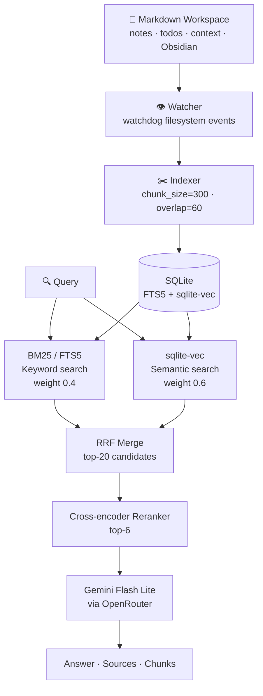

# notes-rag

A self-hosted hybrid RAG engine for personal markdown workspaces. Indexes `.md` files, watches for changes in real time, and serves a streaming chat UI + HTTP API for search, review, wiki synthesis, kanban, and more.

**[Read the engineering writeup →](docs/writeup.md)**

---

## Architecture



**Retrieval pipeline:**
1. Query hits two retrievers in parallel — BM25 (FTS5 keyword search) and sqlite-vec (semantic embeddings)
2. Results merged via Reciprocal Rank Fusion (RRF) — top-20 candidates
3. Cross-encoder reranker re-scores candidates and trims to top-6
4. LLM synthesises an answer from the 6 retrieved chunks, citing filenames

**Indexing pipeline:**
- Files are chunked at 300 chars with 60-char overlap (determined experimentally — see [evaluation](#evaluation))
- Embeddings generated with `all-MiniLM-L6-v2` via fastembed
- Both FTS5 and vector indexes stored in a single SQLite DB — no separate vector store
- Watcher incrementally re-indexes on create/modify/delete; BM25 invalidation is event-driven to prevent stale results
- Documents are classified into wings/rooms via `wings.yaml` rules — classification boosts RRF scores for matched rooms

---

## Project structure

```
notes-rag/
├── main.py              # Entry point — init store, start watcher + API
├── indexer.yaml         # Workspace paths, chunk settings, embedding model
├── wiki.yaml            # Wiki topic seeds
├── wings.yaml           # Document classification rules
│
├── core/                # Foundational pipeline — everything else depends on these
│   ├── store.py         # SQLite store: FTS5 + sqlite-vec, upsert/search/delete
│   ├── embeddings.py    # ONNX embedding adapter (fastembed, no PyTorch)
│   ├── reranker.py      # Cross-encoder reranker (fastembed)
│   ├── search.py        # Hybrid BM25+vector search, RRF, streaming, LLM synthesis
│   ├── indexer.py       # File chunking, embedding, store upsert
│   └── wings.py         # Document classification from wings.yaml rules
│
├── features/            # Feature modules
│   ├── review.py        # Notes review engine: scan, sessions, interviews, frontmatter
│   ├── wiki.py          # Wiki topic synthesis from RAG corpus
│   ├── links.py         # Supersession + related-note detection
│   ├── lifecycle.py     # Confidence scoring, retention decay, supersession sweep
│   ├── entities.py      # Structured entity registry (containers, services, people)
│   ├── lint.py          # Workspace health checks
│   ├── research.py      # Web research: scrape → summarise → save
│   └── wings.py         # (see core/wings.py — shared classification logic)
│
├── infra/               # Infrastructure
│   ├── watcher.py       # watchdog filesystem observer, incremental re-index
│   └── caldav_bridge.py # Reminders queue — Mac bridge for native Reminders
│
├── api/
│   └── app.py           # FastAPI routes for all features (1800+ lines — split planned)
│
├── cli/
│   └── entity_cli.py    # CLI for the entity registry
│
├── ui/                  # Frontend (vanilla JS, PWA)
├── tests/               # pytest suite
├── bench/               # Evaluation harness (query sets, chunk/weight sweeps)
└── deploy/
    └── rag.service      # systemd service file
```

---

## Features

### Chat & Search

A streaming chat interface at `http://localhost:8080/`:

- Queries stream token-by-token via SSE — sidebar populates with retrieved chunks before the LLM finishes
- Each answer shows retrieval latency and total time
- Chunks are expandable with RRF scores and score bars
- Supports folder filtering, BM25/vector weight overrides, and source exclusion

### Notes Review

Review, interview, and tag unreviewed Obsidian notes from the same PWA. Access via the **Review** tab or `/review`.

1. **Triage** — scans for notes with `reviewed: unreviewed` in frontmatter, grouped by RAG vector similarity
2. **Interview** — LLM asks 2–3 contextual questions based on note content, RAG connections, and prior review history
3. **Complete** — tags inferred and written to frontmatter (`reviewed: true`, `tags: [...]`, `review_count: N`); a `## Review N` section appended to the note body

Re-review any note by setting `reviewed: unreviewed` again. `review_count` is tracked so the LLM asks different questions on subsequent passes.

| Component | Location |
|-----------|----------|
| Frontmatter parse/write | `features/review.py` |
| Session manager | `features/review.py` |
| Note grouping (union-find) | `features/review.py` |
| Interview LLM | `features/review.py` |
| Tag inference | `features/review.py` |
| API routes | `api/app.py` — `/review/*` |
| UI | `ui/review.html` |

### Wiki

Synthesises structured topic pages from the RAG corpus. Topics are seeded in `wiki.yaml` and written to the `wiki/` directory in the workspace.

- Access via the **Wiki** tab
- Each topic page is generated by the LLM using retrieved corpus chunks as source material
- Pages are saved as markdown and automatically re-indexed

### Links

User-triggered scan that detects two relationship types between notes:

- **Supersession** — a newer note renders an older one obsolete
- **Related** — notes covering overlapping topics

Detected links are presented for confirmation before being written to frontmatter.

### Lifecycle scoring

Every chunk carries a `lifecycle_score` multiplier (applied post-retrieval) computed from three signals:

| Signal | Description |
|--------|-------------|
| Confidence | Folder-level base score — `todos/` scores lower than `context/` |
| Decay | Recency decay — older notes score lower over time |
| Supersession | Score penalised when the source note is superseded |

Recalculated at startup and can be triggered on-demand via the API.

### Entities

Structured registry of containers, services, repos, people, and concepts stored in `entities.db`.

- Queryable via the `/entities` API or the `entity_cli.py` CLI tool
- Supports upsert, search, export/import (YAML/JSON)

### Kanban

A full kanban board over the todos workspace directory:

- Columns are swimlanes defined in `swimlanes.json` — add/remove via API or UI
- Todos are markdown files with YAML frontmatter (`status`, `priority`, `swimlane`)
- Agent turn endpoint (`POST /kanban/agent`) — send a natural-language instruction to move/update todos via the LLM
- Prerequisite detection (`GET /kanban/todos/prereqs`) — RAG-assisted dependency analysis

### Projects

Project tracking over the workspace. Each project is a directory with associated notes and todos:

- Browse projects, view related docs discovered via RAG similarity
- Create notes and todos scoped to a project

### Research queue

Queue-based async research with three job types:

| Type | Description |
|------|-------------|
| Stash | Save a URL or snippet for later |
| Research | Web search → scrape → LLM summarise → save to Obsidian inbox |
| Forecast | (Polymarket-style) probability forecasting jobs |

### Reminders

A lightweight queue (`reminders.db`) that buffers create-reminder requests for a Mac osascript bridge to consume and create native Reminders entries.

### Models

Runtime model management — list available OpenRouter models, validate a model ID, and hot-swap the active LLM without restarting the service.

---

## Evaluation

Evaluated against 43 queries across 6 categories: factual, reasoning, security, multi-hop, edge-case, temporal.

### Answer quality

| Stage | Score | Notes |
|-------|-------|-------|
| Baseline | 67% | Before any fixes |
| Post security hardening | 77% | After credential leak fixes |
| Security queries | 40% → 100% | Vault token, API keys, DB passwords |

Security hardening added explicit rules to the system prompt to refuse credential disclosure. 3 credential leaks were found and fixed.

### Chunk size sweep

Tested chunk sizes 300, 500, 800, 1200 (all with 20% overlap) on the full query set:

| Chunk size | Answer score | MRR |
|------------|-------------|-----|
| **300** | **73%** | 0.61 |
| 500 | 68% | 0.64 |
| 800 | 65% | 0.67 |
| 1200 | 61% | 0.69 |

Larger chunks improve MRR (retrieval recall) but hurt answer quality — the LLM gets more context but the relevant signal is diluted. chunk_size=300 is the production setting.

### BM25 / vector weight sweep

Tested 7 weight combinations (BM25 0.0–1.0 / vector 1.0–0.0). Results were nearly identical across all combos, confirming that **chunking strategy is the dominant variable**, not ensemble weighting. Production uses 0.4/0.6.

---

## API

All endpoints served by FastAPI on port `8080`.

### Core

| Method | Path | Description |
|--------|------|-------------|
| `GET` | `/` | Streaming chat UI |
| `GET` | `/health` | Health check |
| `GET` | `/stats` | Chunk count + last indexed timestamp |
| `GET` | `/log/recent` | Recent activity log |
| `POST` | `/search` | Hybrid search, sync response |
| `POST` | `/search/stream` | Hybrid search, SSE streaming |
| `POST` | `/similar` | Vector similarity only, no LLM |

### Notes

| Method | Path | Description |
|--------|------|-------------|
| `POST` | `/notes` | Create a new note |
| `GET` | `/notes/search` | Full-text + semantic note search |
| `GET` | `/notes/recent` | Recently modified notes |
| `GET` | `/notes/{id}` | Get note by ID |
| `PATCH` | `/notes/{id}` | Update note content or frontmatter |

### Todos

| Method | Path | Description |
|--------|------|-------------|
| `GET` | `/todos/next-id` | Next available todo ID |
| `GET` | `/todos/pending-count` | Count of pending todos |
| `GET` | `/todos/by-project` | Todos grouped by project |
| `POST` | `/todos` | Create a new todo |

### Wiki

| Method | Path | Description |
|--------|------|-------------|
| `GET` | `/wiki` | List wiki topics |
| `POST` | `/wiki/{topic}/save` | Regenerate and save a topic page |

### Projects

| Method | Path | Description |
|--------|------|-------------|
| `GET` | `/projects` | List all projects |
| `GET` | `/projects/{id}` | Project detail + related docs |
| `POST` | `/projects` | Create project |
| `PATCH` | `/projects/{id}` | Update project |

### Links

| Method | Path | Description |
|--------|------|-------------|
| `POST` | `/links/scan` | Scan a note for supersession/related candidates |
| `POST` | `/links/confirm` | Write confirmed link to frontmatter |
| `POST` | `/links/reject` | Reject a candidate |

### Review

| Method | Path | Description |
|--------|------|-------------|
| `GET` | `/review` | Review UI |
| `GET` | `/review/queue` | Scan unreviewed notes, return grouped triage list |
| `POST` | `/review/start` | Start session, stream first question |
| `POST` | `/review/{id}/reply` | Submit answer, stream next question |
| `POST` | `/review/{id}/complete` | Infer tags, write frontmatter, return results |
| `POST` | `/review/{id}/skip` | Skip note |
| `POST` | `/review/{id}/auto-tag` | Tag without interview |

### Entities

| Method | Path | Description |
|--------|------|-------------|
| `GET` | `/entities` | List entities |
| `GET` | `/entities/{id}` | Get entity |
| `POST` | `/entities` | Upsert entity |

### Kanban

| Method | Path | Description |
|--------|------|-------------|
| `GET` | `/kanban` | Kanban board UI |
| `GET` | `/kanban/todos` | List todos for board |
| `POST` | `/kanban/todos` | Create todo |
| `PATCH` | `/kanban/todos/{id}` | Update todo (status, swimlane, priority) |
| `POST` | `/kanban/refresh` | Re-scan workspace into board |
| `GET` | `/kanban/swimlanes` | List swimlanes |
| `POST` | `/kanban/swimlanes` | Add swimlane |
| `DELETE` | `/kanban/swimlanes/{id}` | Remove swimlane |
| `POST` | `/kanban/agent` | Natural-language instruction to LLM agent |
| `GET` | `/kanban/todos/prereqs` | RAG-assisted prerequisite detection |

### Research queue

| Method | Path | Description |
|--------|------|-------------|
| `POST` | `/queue/stash` | Queue a stash job |
| `POST` | `/queue/research` | Queue a research job |
| `POST` | `/queue/forecast` | Queue a forecast job |
| `GET` | `/queue` | List queued jobs |
| `GET` | `/queue/{id}/status` | Job status |

### Reminders

| Method | Path | Description |
|--------|------|-------------|
| `GET` | `/reminders/queue` | Pending reminders (Mac bridge polls this) |
| `GET` | `/reminders/tracked` | All tracked reminders |
| `POST` | `/reminders/{id}/ack` | Acknowledge a reminder |
| `POST` | `/reminders/{id}/complete` | Mark complete |

### Models

| Method | Path | Description |
|--------|------|-------------|
| `GET` | `/models` | List configured models |
| `POST` | `/models/validate` | Validate a model ID against OpenRouter |
| `PUT` | `/models` | Update active model |

### Services

| Method | Path | Description |
|--------|------|-------------|
| `GET` | `/services/health` | Health check across all registered services |
| `GET` | `/hermes/status` | Hermes async agent status |

---

### POST /search

```json
{
  "query": "What SSH setup do I have?",
  "folder": null,
  "exclude_sources": [],
  "bm25_weight": null,
  "vector_weight": null
}
```

Response includes `answer`, `sources` (deduplicated filenames), and `chunks` (content + source + RRF score per retrieved chunk).

### POST /search/stream

Same request body. Returns SSE events:

```
data: {"type": "retrieved", "chunks": [...], "sources": [...]}
data: {"type": "token", "content": "The SSH..."}
data: {"type": "token", "content": " config..."}
data: {"type": "done"}
```

The `retrieved` event fires immediately after retrieval/rerank — before the LLM starts — so UIs can show sources while the answer streams.

---

## Stack

| Component | Library |
|-----------|---------|
| API | FastAPI + Uvicorn |
| Embeddings | fastembed (`all-MiniLM-L6-v2`, ONNX — no PyTorch) |
| Vector search | sqlite-vec |
| Keyword search | SQLite FTS5 (porter stemmer) |
| Reranker | cross-encoder via fastembed |
| LLM | OpenRouter (default: `google/gemini-2.5-flash-lite`) |
| File watching | watchdog |
| Config | PyYAML |

---

## Setup

```bash
git clone https://github.com/ahproxmox/notes-rag.git
cd notes-rag

python3 -m venv venv
source venv/bin/activate
pip install -r requirements.txt

cp .env.example .env
# Edit .env — set OPENROUTER_API_KEY
```

Edit `indexer.yaml` to point at your workspace:

```yaml
workspace: /path/to/your/notes
exclude: [trash, tmp, temp]
chunk_size: 300
chunk_overlap: 60
embedding_model: all-MiniLM-L6-v2
watch_extra:
  - /path/to/obsidian/vault   # optional extra directories
```

```bash
# Start (builds index on first run, then watches for changes)
python main.py
```

Open `http://localhost:8080` to use the chat UI.

---

## Configuration

| Variable | Default | Description |
|----------|---------|-------------|
| `OPENROUTER_API_KEY` | — | Required. LLM provider |
| `BRAVE_API_KEY` | — | Optional. Enables `/queue/research` web search |
| `LLM_MODEL` | `google/gemini-2.5-flash-lite` | Any OpenRouter model ID |
| `LLM_BASE_URL` | `https://openrouter.ai/api/v1` | Override for local LLMs |
| `RAG_PORT` | `8080` | API port |
| `RAG_CONFIG_PATH` | `./indexer.yaml` | Config file path |
| `VAULT_ADDR` | — | Optional. Enables HashiCorp Vault secret fetch on startup |

---

## Production deployment

A systemd service file is at `deploy/rag.service`:

```bash
cp deploy/rag.service /etc/systemd/system/rag.service
# Edit WorkingDirectory and ExecStart paths
systemctl daemon-reload
systemctl enable --now rag
```

CD is handled by GitHub Actions (`.github/workflows/deploy.yml`) — pushes to `main` trigger an SSH deploy to the configured host via `git fetch && git reset --hard origin/main && bash scripts/deploy.sh`.

---

## Benchmarking

```bash
# Run eval queries against a live endpoint
python bench/run_bench.py --endpoint http://localhost:8080 --output bench/results.json

# Score the results
python bench/score.py bench/results.json

# Sweep chunk sizes (rebuilds index each time — slow)
python bench/chunk_sweep.py

# Sweep BM25/vector weights
python bench/sweep.py

# Compare two result files side by side
python bench/compare.py bench/results-a.json bench/results-b.json
```
