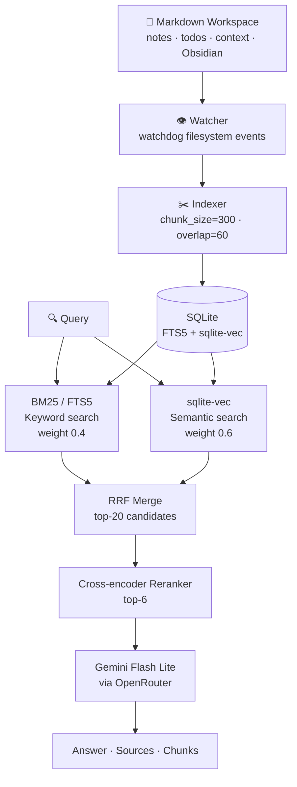

# notes-rag

A self-hosted hybrid RAG engine for personal markdown workspaces. Indexes `.md` files, watches for changes in real time, and serves a streaming chat UI + HTTP API for search and similarity.

**[Read the engineering writeup →](docs/writeup.md)**

---

## Architecture



**Retrieval pipeline:**
1. Query hits two retrievers in parallel — BM25 (FTS5 keyword search) and sqlite-vec (semantic embeddings)
2. Results merged via Reciprocal Rank Fusion (RRF) — top-20 candidates
3. Cross-encoder reranker re-scores candidates and trims to top-6
4. LLM synthesises an answer from the 6 retrieved chunks, citing filenames

**Indexing pipeline:**
- Files are chunked at 300 chars with 60-char overlap (determined experimentally — see [evaluation](#evaluation))
- Embeddings generated with `all-MiniLM-L6-v2` via fastembed
- Both FTS5 and vector indexes stored in a single SQLite DB — no separate vector store
- Watcher incrementally re-indexes on create/modify/delete; BM25 invalidation is event-driven to prevent stale results

---

## Demo UI

A streaming chat interface is served at `http://localhost:8080/`:

- Queries stream token-by-token via SSE — sidebar populates with retrieved chunks before the LLM finishes
- Each answer shows retrieval latency and total time
- Chunks are expandable with RRF scores and score bars

---


## Notes Review

A second mode alongside search — lets you review, interview, and tag unreviewed Obsidian notes from the same PWA.

Access via the **Review Notes** button in the header, or navigate to `/review`.

### How it works

1. **Triage** — tap "Review Notes" to scan for all notes with `reviewed: unreviewed` in their frontmatter. Notes are grouped by RAG vector similarity (related notes shown together with a badge).
2. **Interview** — select a note or group. The LLM asks 2–3 contextual questions based on note content, RAG connections to existing knowledge, and any previous review history (for re-reviews).
3. **Complete** — tags are inferred and written to frontmatter (`reviewed: true`, `tags: [...]`, `review_count: N`). A `## Review N` section is appended to the note body with a Q&A summary.

### Re-review

Set `reviewed: unreviewed` on any note to queue it for another pass. The system tracks `review_count` in frontmatter and shows previous review Q&A to the LLM so it asks different questions.

### Note grouping

Notes are grouped using pairwise vector similarity (union-find, threshold 0.4). Grouped notes can be reviewed together in a single joint interview — the LLM asks bridging questions that connect them.

### Review engine

| Component | File | Description |
|-----------|------|-------------|
| Frontmatter parse/write | `review.py` | Safe YAML round-trip, `---` in body handled correctly |
| Session manager | `review.py` | In-memory sessions per browser session |
| Note grouping | `review.py` | Union-find on pairwise RAG similarity |
| Interview LLM | `review.py` | Gemini Flash Lite, streaming via `generate_question()` |
| Tag inference | `review.py` | Async `infer_tags()` — up to 5 lowercase-hyphenated tags |
| API routes | `api.py` | `/review/*` route group |
| UI | `ui/review.html` | Mobile-first, dark theme, SSE streaming |

### Review API routes

| Method | Path | Description |
|--------|------|-------------|
| `GET` | `/review` | Review UI page |
| `GET` | `/review/queue` | Scan unreviewed notes, return grouped triage list |
| `POST` | `/review/start` | Start session, stream first question |
| `POST` | `/review/{id}/reply` | Submit answer, stream next question |
| `POST` | `/review/{id}/complete` | Infer tags, write frontmatter, return results |
| `POST` | `/review/{id}/skip` | Skip note (no-op) |
| `POST` | `/review/{id}/auto-tag` | Tag without interview |


## Evaluation

Evaluated against 43 queries across 6 categories: factual, reasoning, security, multi-hop, edge-case, temporal.

### Answer quality

| Stage | Score | Notes |
|-------|-------|-------|
| Baseline | 67% | Before any fixes |
| Post security hardening | 77% | After credential leak fixes |
| Security queries | 40% → 100% | Vault token, API keys, DB passwords |

Security hardening added explicit rules to the system prompt to refuse credential disclosure. 3 credential leaks were found and fixed.

### Chunk size sweep

Tested chunk sizes 300, 500, 800, 1200 (all with 20% overlap) on the full query set:

| Chunk size | Answer score | MRR |
|------------|-------------|-----|
| **300** | **73%** | 0.61 |
| 500 | 68% | 0.64 |
| 800 | 65% | 0.67 |
| 1200 | 61% | 0.69 |

Larger chunks improve MRR (retrieval recall) but hurt answer quality — the LLM gets more context but the relevant signal is diluted. chunk_size=300 is the production setting.

### BM25 / vector weight sweep

Tested 7 weight combinations (BM25 0.0–1.0 / vector 1.0–0.0). Results were nearly identical across all combos, confirming that **chunking strategy is the dominant variable**, not ensemble weighting. Production uses 0.4/0.6.

---

## API

All endpoints served by FastAPI on port `8080`.

| Method | Path | Description |
|--------|------|-------------|
| `GET` | `/` | Streaming chat UI |
| `GET` | `/health` | Health check |
| `GET` | `/stats` | Chunk count + last indexed timestamp |
| `POST` | `/search` | Hybrid search, sync response |
| `POST` | `/search/stream` | Hybrid search, SSE streaming |
| `POST` | `/similar` | Vector similarity only, no LLM |
| `POST` | `/research` | Web research → scrape → summarise → save |
|  |  | Notes review UI (triage + interview) |
|  |  | Scan for unreviewed notes, grouped by similarity |
|  |  | Start interview session, stream first question |
|  |  | Submit answer, stream next question |
|  |  | Complete review — write tags + review section |
|  |  | Auto-tag note without interview |

### POST /search

```json
{
  "query": "What SSH setup do I have?",
  "folder": null,
  "exclude_sources": [],
  "bm25_weight": null,
  "vector_weight": null
}
```

Response includes `answer`, `sources` (deduplicated filenames), and `chunks` (content + source + RRF score per retrieved chunk).

### POST /search/stream

Same request body. Returns SSE events:

```
data: {"type": "retrieved", "chunks": [...], "sources": [...]}
data: {"type": "token", "content": "The SSH..."}
data: {"type": "token", "content": " config..."}
data: {"type": "done"}
```

The `retrieved` event fires immediately after retrieval/rerank — before the LLM starts — so UIs can show sources while the answer streams.

---

## Stack

| Component | Library |
|-----------|---------|
| API | FastAPI + Uvicorn |
| Embeddings | fastembed (`all-MiniLM-L6-v2`) |
| Vector search | sqlite-vec |
| Keyword search | SQLite FTS5 (porter stemmer) |
| Reranker | cross-encoder via fastembed |
| LLM | OpenRouter (default: Gemini Flash Lite) |
| File watching | watchdog |
| Config | PyYAML |

---

## Setup

```bash
git clone https://github.com/ahproxmox/notes-rag.git
cd notes-rag

python3 -m venv venv
source venv/bin/activate
pip install -r requirements.txt

cp .env.example .env
# Edit .env — set OPENROUTER_API_KEY
```

Edit `indexer.yaml` to point at your workspace:

```yaml
workspace: /path/to/your/notes
exclude: [trash, tmp, temp]
chunk_size: 300
chunk_overlap: 60
embedding_model: all-MiniLM-L6-v2
watch_extra:
  - /path/to/obsidian/vault   # optional extra directories
```

```bash
# Start (builds index on first run, then watches for changes)
python main.py
```

Open `http://localhost:8080` to use the chat UI.

---

## Configuration

| Variable | Default | Description |
|----------|---------|-------------|
| `OPENROUTER_API_KEY` | — | Required. LLM provider |
| `BRAVE_API_KEY` | — | Optional. Enables `/research` endpoint |
| `LLM_MODEL` | `google/gemini-2.5-flash-lite` | Any OpenRouter model ID |
| `LLM_BASE_URL` | `https://openrouter.ai/api/v1` | Override for local LLMs |
| `RAG_PORT` | `8080` | API port |
| `RAG_CONFIG_PATH` | `./indexer.yaml` | Config file path |
| `VAULT_ADDR` | — | Optional. Enables HashiCorp Vault secret fetch on startup |

---

## Production deployment

A systemd service file is at `deploy/rag.service`:

```bash
cp deploy/rag.service /etc/systemd/system/rag.service
# Edit paths in the service file
systemctl daemon-reload
systemctl enable --now rag
```

---

## Benchmarking

```bash
# Run eval queries against a live endpoint
python bench/run_bench.py --endpoint http://localhost:8080 --output bench/results.json

# Score the results
python bench/score.py bench/results.json

# Sweep chunk sizes (rebuilds index each time — slow)
python bench/chunk_sweep.py

# Sweep BM25/vector weights
python bench/sweep.py

# Compare two result files side by side
python bench/compare.py bench/results-a.json bench/results-b.json
```
